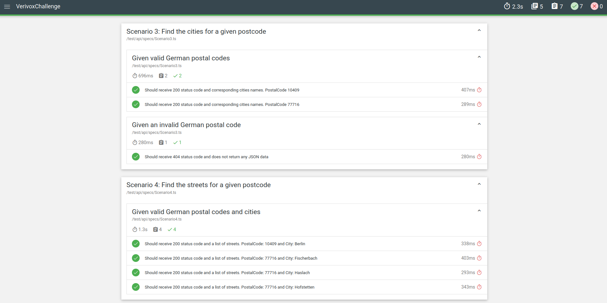
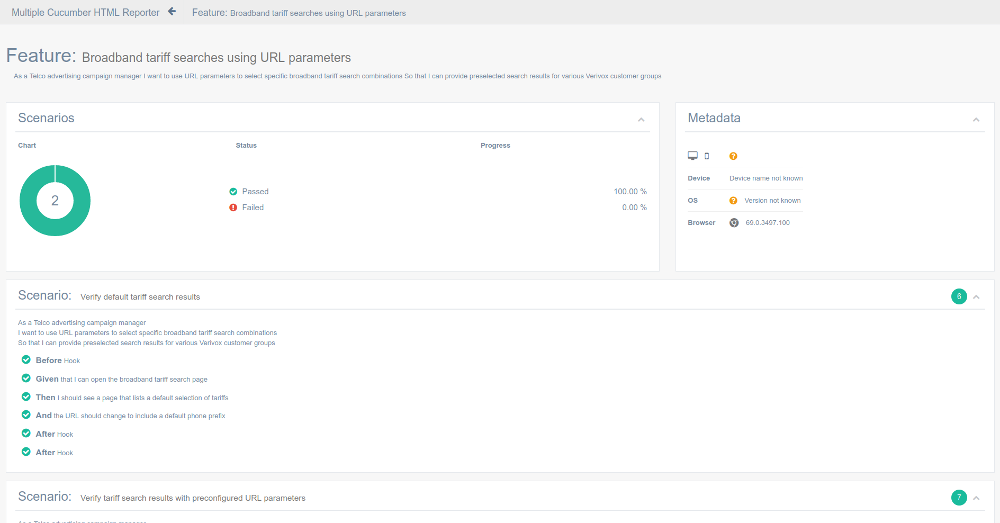

# VerivoxChallenge
Project with E2E/UI tests using WebDriverIO and API tests with SuperTest

* Requirements to run:
    * NodeJs
    * Npm
    * Docker (if you want to run the E2E/UI tests inside containers)

* Setup instructions
    * Run ```npm install``` to install all the dependencies


# API Tests

* Main API Tests stack:
    * [SuperTest](https://github.com/visionmedia/supertest)
    * Typescript
    * Mocha
    * Chai

* API Tests Features:
    * Parameterized Tests
    * Json Schema validation with [Joi](https://joi.dev/) 
    * Environment variables config with [Dotenv](https://github.com/motdotla/dotenv)
    * HTML Report with [Mochawesome](https://github.com/adamgruber/mochawesome)
    * Lint and Code Style with [ESlint](https://eslint.org/)
    * Git Hooks with [Husky](https://github.com/typicode/husky)


* Instructions to run API tests:
    * ```npm run test:api ```
    * To generate a HTML report: ```npm run test:api:generateReport```
        * The report is generated in the path test/api/report

* Intructions to run Lint:
    * To check code: ```npm run lint```
    * To fix code: ```npm run lint:fix```

* Other info:
    * For API Tests, I followed the Gherkin scenarios specified in the documentation, but I prefered to use the simpler Mocha implementation for writing those scenarios, instead of using Cucumber. This is a cleaner way of writing the scenarios and one less layer to give maintenance;
    
* Report:



# UI/E2E Tests

* Main UI/E2E Tests stack:
    * [WebdriverIO](https://webdriver.io/)
    * Typescript
    * Mocha
    * Chai

* UI/E2E Tests Features:
    * BDD with CucumberJS
    * HTML Report with Cucumber report
    * Screnshots capture and attached into the report when tests fail
    * Docker config to run tests in containers;
        * Includes config for cross browser testing: Chrome and Firefox
    * Lint and Code Style with [ESlint](https://eslint.org/)
    * Git Hooks with [Husky](https://github.com/typicode/husky)

* Instructions to run UI/E2E tests:
    * ```npm run test:ui ```
        * The HTML report is generated automatically in the path test/e2e/report
    * If you want to execute the tests with Docker:
        * run ```npm run docker:up:grid``` to bring up the selenium grid
        * then run: ```npm run test:remoteGrid ```

* Intructions to run Lint:
    * To check code: ```npm run lint```
    * To fix code: ```npm run lint:fix```


* Report:

